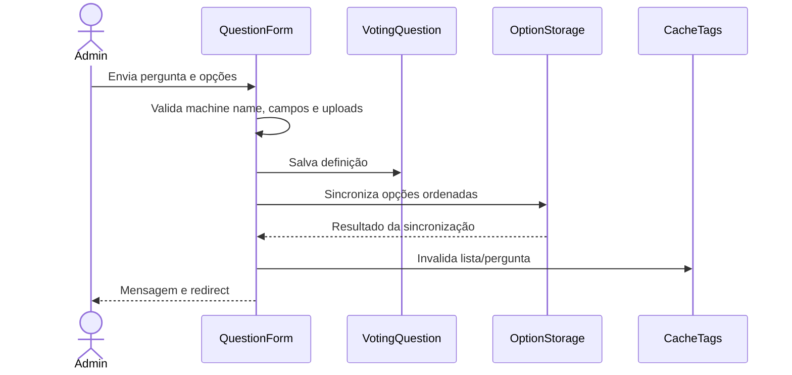
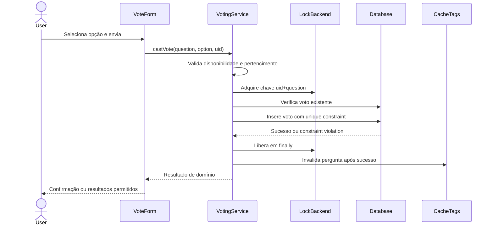
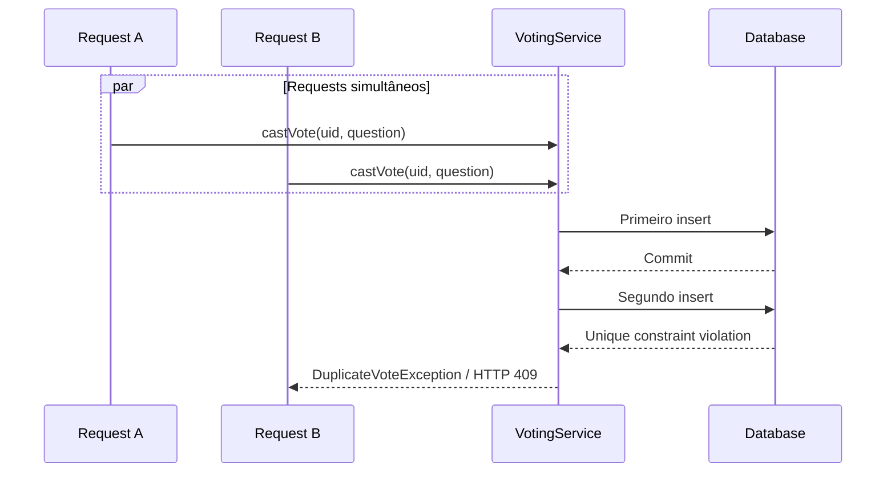
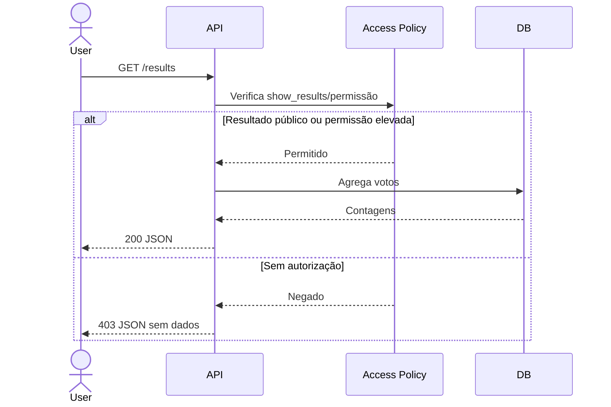

# Fluxos principais

Os diagramas abaixo representam o fluxo implementado no código. Os cenários integrados, incluindo o fluxo de voto concorrente, foram executados e validados pelo mantenedor em 2026-09-09.

## Cadastro administrativo

## Voto pelo CMS

## Voto concorrente

## API de resultado oculto

